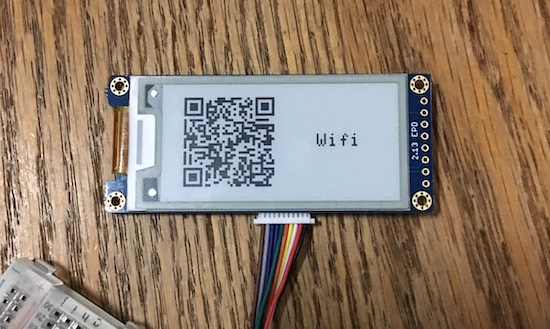

# QRCode ePaper for LOLIN D32 Pro

## § 材料準備

1. [LOLIN D32 Pro](https://wiki.wemos.cc/products:d32:d32_pro)
2. [ePaper 2.13 Shield](https://wiki.wemos.cc/products:d1_mini_shields:epd_2.13_shield)
3. TFT e-Paper Cable

可以在 [WEMOS.CC](https://www.wemos.cc/) 找到這些零件的購買網址與詳細資訊。

> 購買網址：[LOLIN Official Store](https://lolin.aliexpress.com/store/1331105)

 

## § 組裝

將 ePaper Shield 連接到 LOLIN D32 Pro：

 

## § 設定 Arduino IDE 環境

1. 請先閱讀 [arduino-esp32](https://github.com/espressif/arduino-esp32) 的 README.md，照裡頭的步驟安裝好 ESP32 Board 套件。
2. 然後到 [WEMOS wiki](https://wiki.wemos.cc/downloads) 裡下載 Serial port Driver，並安裝之。
3. 把 D32 Pro 連接到電腦上，然後克隆或是下載本 Repo，並用 Arduino IDE 開啟 `EPD_QR.ino`。
4. 點選 Arduino IDE 選單 -> Sketch -> Include Library -> Manage Libraries...，然後搜尋並安裝以下程式庫：

    - Adafruit GFX Library (by Adafruit)
    - QRCode (by Richard Moore)

5. 下載 [LOLIN_EPD_Library](https://github.com/wemos/LOLIN_EPD_Library)，並用 Arduino IDE 選單 -> Sketch -> Include Library -> Add .ZIP Library... 安裝之。
6. 點選 Arduino IDE 選單 -> Tools -> Board: -> 選擇 `LOLIN D32 PRO`； Upload Speed: -> 選擇 `115200`； Flash Frequency: -> 選擇 `40MHz`。
7. 點選 Arduino IDE 選單 -> Tools -> Port，選擇連接 D32 Pro 的 Serial port，Windows 上的名稱通常都是 COM`X`，Mac 上的名稱通常都是 /dev/cu.wchusbserial`XXXX` (X 為數字)。例如下圖：

**Port 選擇 (Windows)：**

**Port 選擇 (macOS)：**

 

## § 修改 AP 的 SSID 跟 Password

因為會把 D32 Pro 變成一台 WiFi AP，你可以修改此處的 SSID 跟 Password：

 

## § 編譯並上傳程式

按下 Arduino IDE 的 Upload 按鈕，編譯並上傳程式到 D32 Pro：

 

## § 連線到 AP

我們先連線到 AP (程式裡預設的 SSID 是 `EPD_SETUP_AP`，密碼是 `pw112233`)，例如下圖：

接著要開啟 QRCode Setup 網頁。開啟網頁瀏覽器，並輸入 Server 的 IP (Server IP 會在裝置啟動時顯示在 ePaper 上)：

 

## § 設定 QRCode

開啟 QRCode Setup 網頁後，分別有網站網址、WiFi、純文字等 QRCode 類型，輸入資訊後，按下 `Update` 按鈕即可顯示/更新 QRCode：

 

如果勾選 `Display type`，那麼 QRCode 右方還會顯示類型的文字：

 

沒有勾選 `Display type`，那麼 ePaper 只顯示 QRCode：

 

WiFi QRcode + 顯示類型文字：

純文字 QRcode + 顯示類型文字：

 

## § 拔掉電源

因為 ePaper 移除電源後，依然可以顯示最後一個呈現的畫面，所以我們設定好 QRCode 後，可以把 D32 Pro 的電源移除，並將 TFT e-Paper Cable 拔掉，然後把 ePaper Shield 貼到牆上或是放到你想放置的地方：

